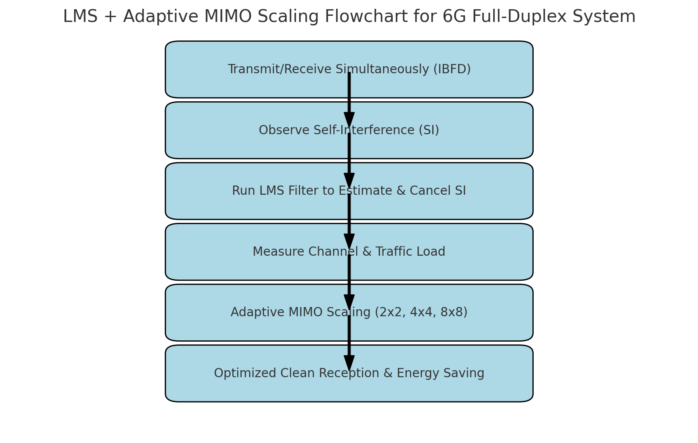
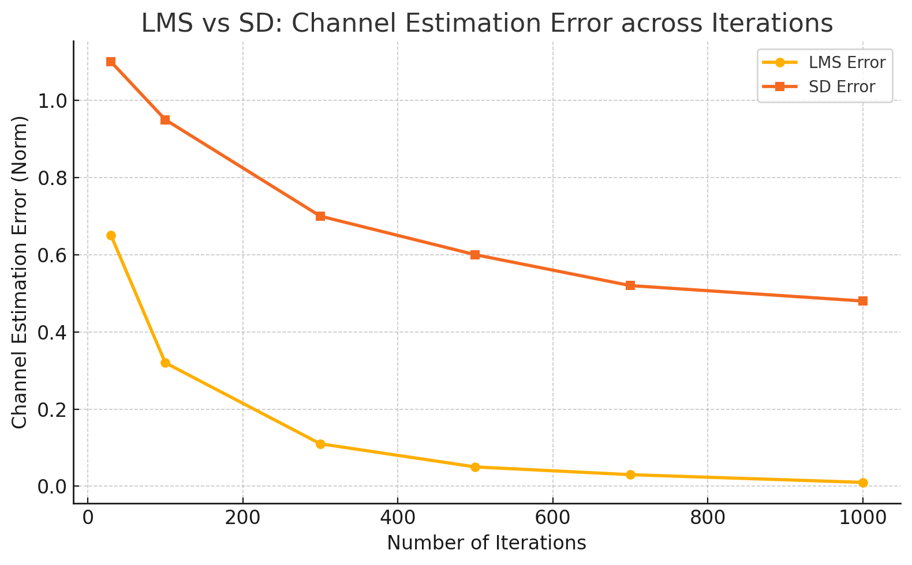
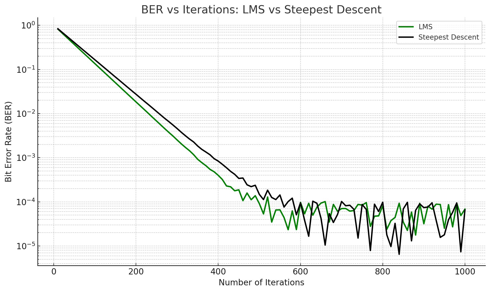
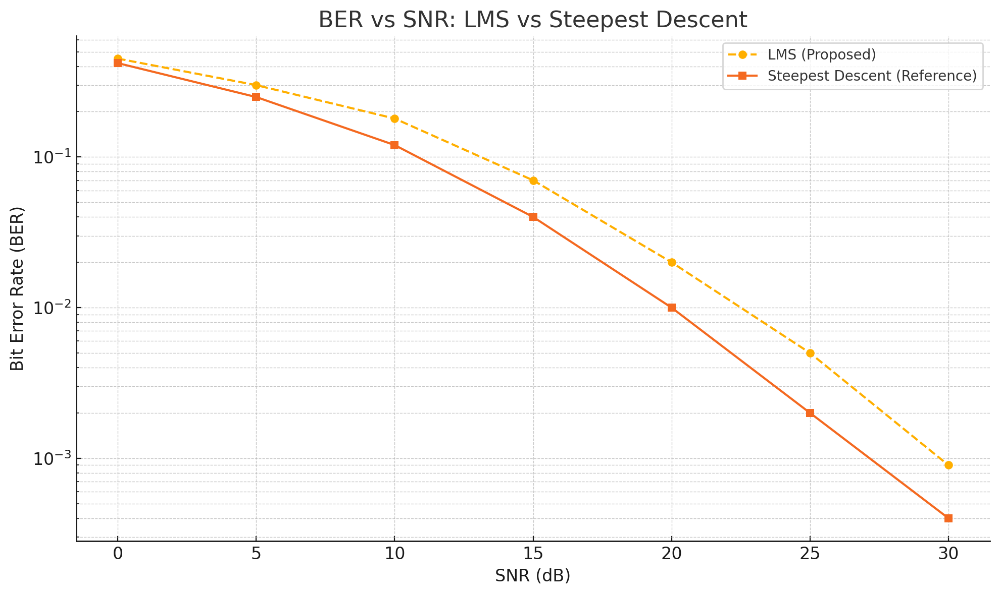
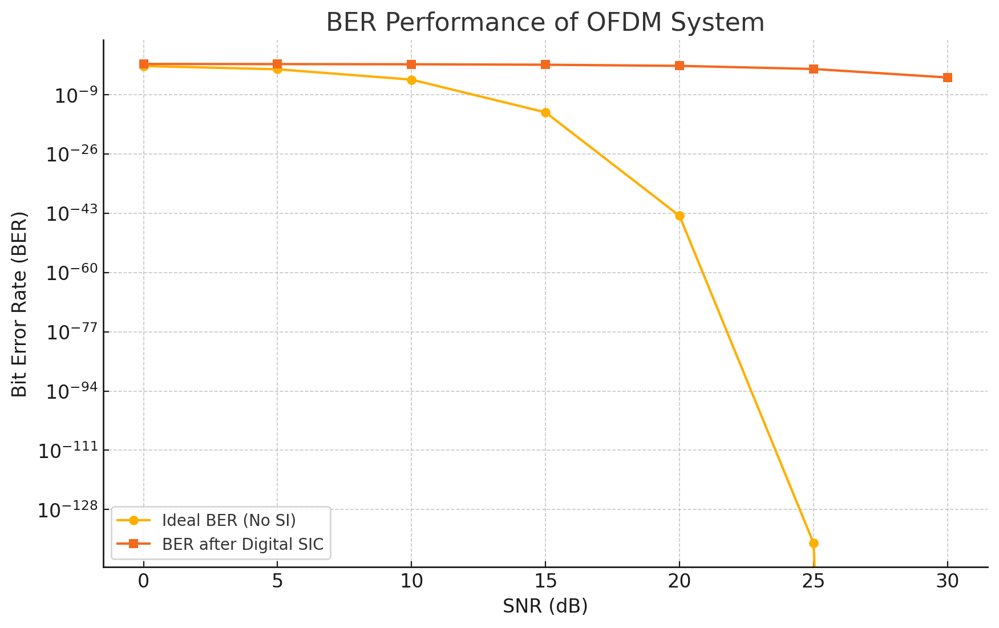

# 6G Digital Self-Interference Cancellation

## Overview

This project investigates **digital self-interference cancellation (SIC)** for **in-band full-duplex (IBFD) communication systems** targeting future 6G networks.

In full-duplex communication, transmission and reception occur simultaneously on the same frequency band. This can introduce strong self-interference at the receiver and significantly affect communication performance.

The project focuses on MATLAB-based modelling and simulation of digital self-interference cancellation using **Least Mean Squares (LMS)** and **Steepest Descent (SD)** adaptive algorithms.

---

## Project Objectives

The main objectives of this project were to:

- Investigate self-interference in in-band full-duplex communication.
- Develop a MATLAB-based simulation model.
- Implement adaptive channel estimation approaches.
- Compare LMS and Steepest Descent algorithms.
- Evaluate channel estimation error.
- Analyse BER performance across different iteration counts.
- Investigate BER performance under different SNR conditions.
- Examine OFDM-based communication performance.

---

## System Concept

The digital self-interference cancellation process consists of estimating the interference component and removing it from the received signal.

The general system concept is:

**Transmitter → Full-Duplex Channel → Receiver → Self-Interference Estimation → Digital Cancellation → Desired Signal**

---

## System Flowchart



---

# Methodology

## LMS Adaptive Algorithm

The **Least Mean Squares (LMS)** algorithm was investigated as an adaptive approach for estimating the self-interference channel.

The filter coefficients are updated iteratively according to the estimation error.

The general LMS update equation is:

\[
w(n+1) = w(n) + \mu e(n)x(n)
\]

where:

- `w(n)` represents the adaptive filter coefficients.
- `μ` represents the step size.
- `e(n)` represents the estimation error.
- `x(n)` represents the input signal.

---

## Steepest Descent Algorithm

The **Steepest Descent (SD)** algorithm was evaluated as a second adaptive channel estimation approach.

The algorithm updates the filter coefficients in a direction intended to minimise the mean-square error.

LMS and Steepest Descent were compared using simulation-based performance metrics.

---

# Performance Evaluation

The algorithms were evaluated using:

- Channel estimation error
- Bit Error Rate (BER)
- Iteration count
- Signal-to-Noise Ratio (SNR)

These metrics were used to investigate convergence and communication-system performance.

---

## Channel Estimation Error

The channel estimation error was evaluated for different numbers of iterations to compare the convergence behaviour of LMS and Steepest Descent.



---

## BER vs Iterations

BER performance was evaluated as the number of adaptive iterations increased.



---

## BER vs SNR

The relationship between BER and SNR was investigated to evaluate communication performance under different signal-to-noise conditions.



---

## OFDM Performance

An OFDM-based communication scenario was also investigated to examine BER performance in a multicarrier communication system.



---

# Key Findings

The simulation results demonstrate the application of adaptive digital signal processing techniques to self-interference mitigation in full-duplex communication systems.

The LMS and Steepest Descent approaches were compared based on:

- Channel estimation error
- BER performance
- Number of iterations
- SNR conditions
- Convergence behaviour

The results provide insight into the performance trade-offs associated with adaptive digital self-interference cancellation.

---

# Engineering Skills Demonstrated

### Telecommunications & Communications

- Full-duplex communication
- Self-interference cancellation
- OFDM
- MIMO communication concepts
- Channel estimation
- Digital signal processing
- BER and SNR analysis

### Engineering & Analysis

- System modelling
- MATLAB simulation
- Algorithm comparison
- Performance evaluation
- Engineering problem solving
- Data analysis
- Verification and interpretation of simulation results
- Technical documentation

---

# Tools & Technologies

| Tool / Technology | Application |
|---|---|
| MATLAB | Communication-system modelling and simulation |
| LMS | Adaptive channel estimation |
| Steepest Descent | Adaptive channel estimation |
| OFDM | Multicarrier communication modelling |
| MIMO | Wireless communication system modelling |
| GitHub | Project documentation and version control |

---

# Project Structure

The repository currently contains the project documentation and simulation results:

```text
6G-Digital-Self-Interference-Cancellation/
│
├── README.md
│
├── Digital_SIC_System_Flowchart.png
├── LMS_vs_SD_Channel_Estimation_Error.png
├── LMS_vs_SD_BER_vs_Iterations.png
├── LMS_vs_SD_BER_vs_SNR.png
└── OFDM_BER_Performance.png
---

## System Flowchart


---

## Methodology

### 1. Self-Interference Modelling

A full-duplex communication scenario was modelled in MATLAB to represent the interference introduced by simultaneous transmission and reception.

The received signal consists of the desired communication signal together with self-interference and noise.

### 2. LMS Adaptive Filtering

The **Least Mean Squares (LMS)** algorithm was investigated as an adaptive approach for estimating the self-interference channel.

LMS iteratively updates the filter coefficients based on the estimation error.

The general update relationship is:

\[
w(n+1) = w(n) + \mu e(n)x(n)
\]

where:

- `w(n)` = adaptive filter coefficient
- `μ` = step size
- `e(n)` = estimation error
- `x(n)` = input signal

### 3. Steepest Descent

The **Steepest Descent (SD)** algorithm was also evaluated for channel estimation.

The algorithm updates the filter coefficients in the direction that reduces the mean-square error.

### 4. Performance Evaluation

The algorithms were evaluated using:

- Channel estimation error
- BER
- Number of iterations
- SNR

This allowed the behaviour of the two adaptive approaches to be compared under different simulation conditions.

---

## Results

### Channel Estimation Error

The channel estimation error was evaluated across different iteration counts.


The simulation results show the convergence behaviour of the LMS and Steepest Descent approaches.

---

### BER vs Iterations

BER performance was also evaluated as the number of adaptive iterations increased.


This analysis provides an indication of how iterative adaptation affects communication performance.

---

### BER vs SNR

The relationship between BER and SNR was investigated to assess communication performance under different signal-to-noise conditions.


---

### OFDM Performance

An OFDM-based communication scenario was also investigated to examine BER performance in a multicarrier communication system.


---

## Key Findings

The simulation-based investigation indicates that adaptive digital signal processing can be used to estimate and mitigate self-interference in full-duplex communication systems.

The comparison of LMS and Steepest Descent considered:

- Convergence behaviour
- Channel estimation error
- BER performance
- Iteration count
- SNR conditions

The results provide practical insight into the trade-offs involved in selecting adaptive cancellation algorithms for digital self-interference mitigation.

---

## Engineering Skills Demonstrated

This project demonstrates practical experience in:

- MATLAB
- Digital signal processing
- Wireless communications
- Full-duplex communication systems
- OFDM
- MIMO communication concepts
- Adaptive filtering
- Channel estimation
- BER and SNR analysis
- System modelling
- Simulation and verification
- Engineering data analysis
- Technical documentation
- Problem solving

---

## Relevance to Communications and Systems Engineering

The project involved taking a communication-system problem, developing a mathematical and simulation-based model, implementing alternative engineering approaches, and evaluating their performance using measurable system-level metrics.

The methodology is relevant to engineering environments involving:

- Telecommunications infrastructure
- Wireless communication systems
- Signal processing
- Systems engineering
- Network performance analysis
- Engineering verification and testing

---

## Tools

| Tool | Application |
|---|---|
| MATLAB | System modelling and simulation |
| MATLAB Signal Processing | Communication and signal analysis |
| OFDM | Multicarrier communication modelling |
| Adaptive Algorithms | Self-interference estimation and cancellation |
| GitHub | Version control and project documentation |

---

## Project Structure

```text
6G-Digital-Self-Interference-Cancellation/
│
├── README.md
│
├── MATLAB/
│   ├── LMS_Estimate.m
│   ├── SteepestDescent.m
│   └── main_simulation.m
│
├── results/
│   ├── LMS_vs_SD_Channel_Estimation_Error.png
│   ├── LMS_vs_SD_BER_vs_Iterations.png
│   ├── LMS_vs_SD_BER_vs_SNR.png
│   ├── OFDM_BER_Performance.png
│   └── Digital_SIC_System_Flowchart.png
│
└── report/
